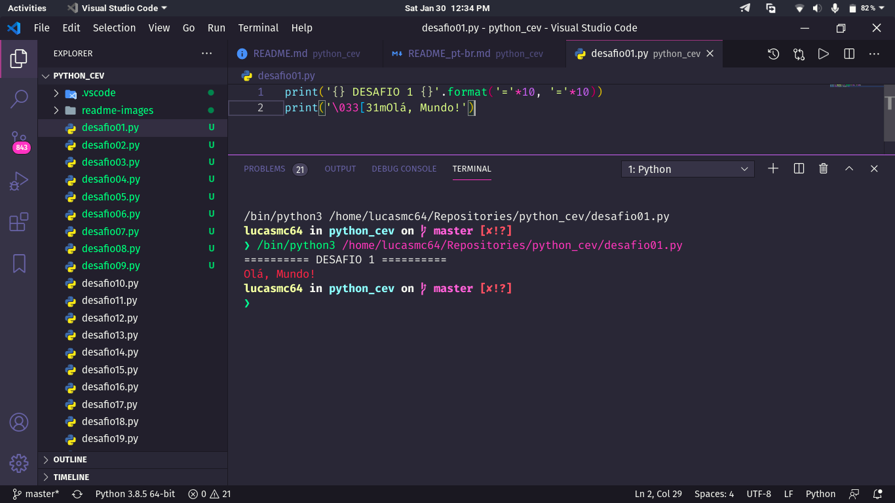

# :man_technologist: Python Course

## :play_or_pause_button:​ What is Curso em Vídeo?

CeV is a project designed by Professor Gustavo Guanabara with the aim of bringing quality education to anyone who has access to the internet.

[Website](https://www.cursoemvideo.com/) | [YouTube Channel](https://www.youtube.com/user/cursosemvideo)

## :dart: Goal

These different small projects aim to exemplify and practice the basics of Python, one of the languages of the moment.

## :scroll: Some details

### :desktop_computer: About the project

- Exercises done in Python 3.

### :book: About the course

It is a basic course, but it is still complete given its target audience. Professor Gustavo Guanabara has great teaching skills and the course is available for free on the internet.

#### :green_book: Course on Youtube

[Python 3 - World 1](https://www.youtube.com/playlist?list=PLHz_AreHm4dlKP6QQCekuIPky1CiwmdI6) | [Python 3 - World 2](https://www.youtube.com/playlist?list=PLHz_AreHm4dk_nZHmxxf_J0WRAqy5Czye) | [Python 3 - World 2](https://www.youtube.com/playlist?list=PLHz_AreHm4dksnH2jVTIVNviIMBVYyFnH)

#### :blue_book: Course on Website

[Python 3 - World 1](https://www.cursoemvideo.com/course/python-3-mundo-1/) | [Python 3 - World 2](https://www.cursoemvideo.com/course/python-3-mundo-2/) | [Python 3 - World 3](https://www.cursoemvideo.com/course/python-3-mundo-3/)

## :thinking: How do I run the project on my machine?

The first step is to clone the project, either via terminal or GitHub Desktop, or even by downloading the compressed file (.zip). After that, go ahead.

### :hammer_and_wrench: Requirements

> There are no requirements to perform some of the exercises on your computer! Just double click on the file with extension *.html* and it will open in your default browser.
>
> However, to run some JavaScript files individually we need some tools.

- [Python 3](https://www.python.org).
- [VSCode](https://code.visualstudio.com/) and the extension [Python](https://marketplace.visualstudio.com/items?itemName=ms-python.python).

### :sparkles: Running the JS files

Open the project folder in VSCode and, by right-clicking on the file with extension *.py*, choose *Run Python File in Terminal*. The terminal will open with the code results.

## :tada: If everything went well...

Now you are running the project beautifully!

## :memo: License

This project is under the MIT license. See the [LICENSE](LICENSE) for more information.

---

Made with :white_heart: by Lucas Coutinho :wave: [Get in touch!](https://www.linkedin.com/in/lucasmc64/)